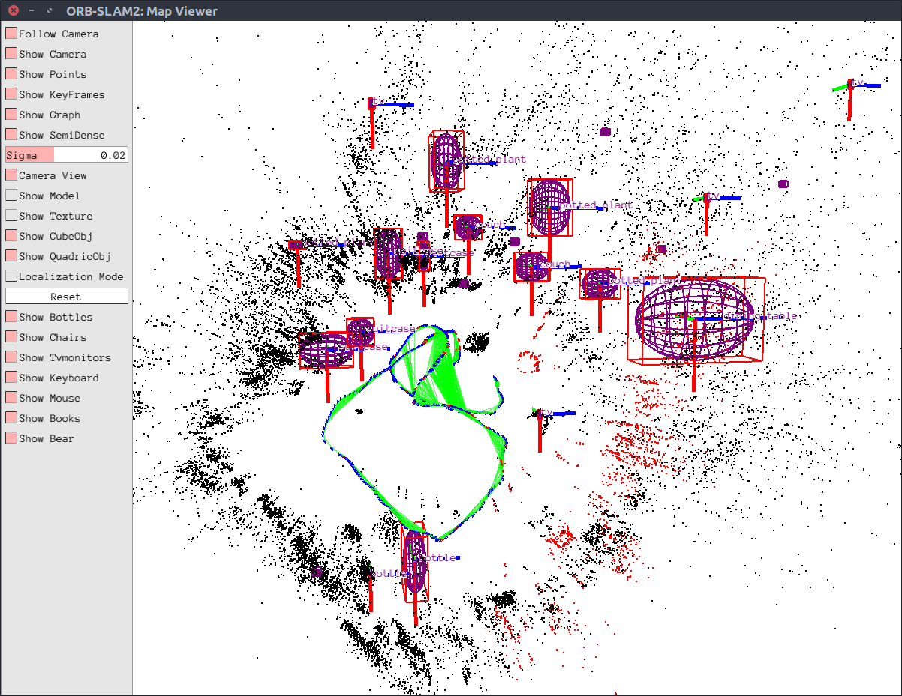

# EAO-Fusion
**目标：试图调整 EAO-SLAM 使其能够在RGBD-IMU系统上实时可用**

目前不再更新非ros版本，后续继续补充

### 0 可视化结果



### 1 过程记录

**已完成部分：**

+ 增加实时YOLOX检测系统，能够实时而非在线的处理数据；
+ 另开一个线程处理检测模块
+ 去除真值约束，对比加上和不加垂直方向的初始约束的效果；
+ 加入ROS系统（`ros_test`），能够使用RealSense D435i相机进行单目场景运行；
+ 对程序进行DEBUG，修复了不能够顺利保存轨迹的问题；
+ 将传感器的仅限于单目改为支持RGBD，并完成ROS接口的封装；
+ 同步后IMU代替真值进行垂直方向上的约束
+ 语义标签可视化，并在pangolin上显示语义标签（很遗憾不能修改字体大小，不知为何会报错）
+ 学习pangolin的二次曲面可视化，并为二次曲面增加立体边框和指向轴，更加美观
+ 分离RGBD和RGBD-IMU模块，在多个数据集下进行了测试
+ 增加平面约束，参考北航大佬的论文 [Object-oriented SLAM using Quadrics and Symmetry Properties for Indoor Environments]
+ 去除了立方体表示和直线特征

**正在进行的修改：**

+ 作者部分代码和论文对不上，正在修复
+ 作者对二次曲面的处理是灾难性的，需要重写

**未完成部分：**

+ 可以微调下YOLOX模块，使其对室内环境更加友好
+ 在RGBD下尝试单帧初始化
+ 平面约束和物体进行融合
+ 物体参与优化
+ 试图融合层次化物体建模
+ ~~加入多传感器融合过程，主要以IMU为主，看情况是否加入编码器~~

### 2 环境构建

```yaml
Ubuntu: 16.04
opencv: 3.3.1
Eigen: 3.2.1
ceres: 1.14.0
Pangolin: 0.6
rapidjson: 1.1.0
```

另外由于借助了YOLOX的推理系统，因此安装了cude和tensorRT，可根据需求自己进行调整（CMakeLists.txt）
